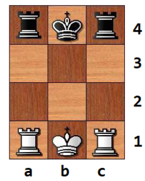

# XO (mandatory) #
Write a bot that plays 3x3 regular tic-tac-toe.
Use [this snippet](https://github.com/hsu-ai-course/hsu.ai/blob/master/code/02.%20Ti%D1%81-Ta%D1%81-Toe.ipynb) as a starting point.

# Strange chess (advanced) #
Imaging chessboard like this:

Using normal chess rules, write a bot that plays these chess *for white*.
Implement any game strategy you prefer.
Print the sequence (any, or shortest) of moves that leads to win.
