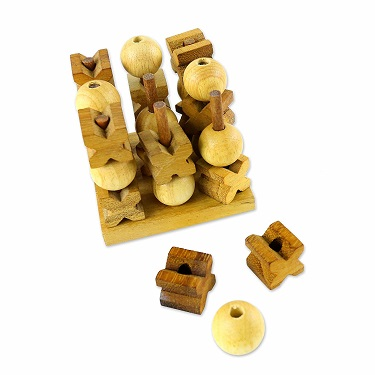

# 3D XO (mandatory) #
Write a bot that plays 3x3x3 cubic tic-tac-toe.
Consider you have a cube, where you can put a piece only on top of the floor or other piece (rule of gravity).

Any row of 3 is a win.
Write a bot that plays this version of XO.

# Strange chess (advanced) #
Imaging chessboard like this:

Using normal chess rules, write a bot that plays these chess *for white*.
Implement any game strategy you prefer.
Print the sequence (any, or shortest) of moves that leads to win.