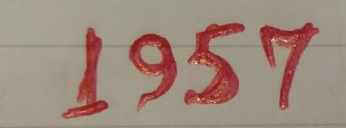

## Recognize hand-written number (Mandatory) ##
For this image:
- binarize
- dilate if needed
- detect connected components
- create bounding boxes
- recognize numbers using any pretrained classifier
- **visualize your result** (draw bounding boxes around numbers and print predictions).

## Advanced ##
Consider [this script](https://github.com/str-anger/practical-ai/blob/master/4/classification-ann.ipynb). It has 2 parts: fully-connected ANN for binary classification and convolutional network for 10-class classification.
Combine these approaches. Train your own convolutional binary classifier for cats and dogs. Is it better than fully-connected? Is it trained faster?