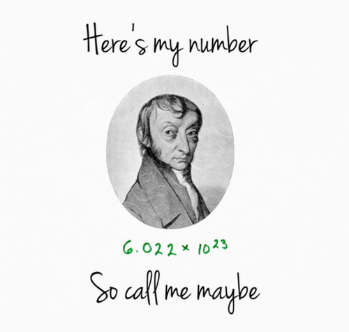
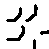
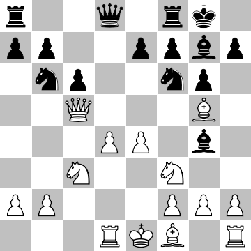
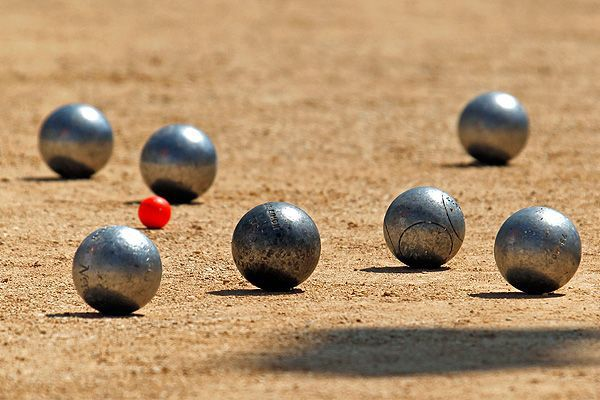

## 1 ## 
Recognize hand-written digits on the picture.


**bonus**: align them in correct order.

## 2 ## 
What is the [note](./note.wav)?

**bonus**: do it automatically.

## 3 ## 
Extract **actor (subject)**, **action** and **object** from these sentences:
```
Ann rides a bicycle to the sea.
Bus goes to garage.
Bank of Spain will invest billions of dollars in green energy.
```
**bonus**: `Student claims he solved hometask.`

## 4 ## 
Implement a bot, that **reads** you a fact on a given topic with a voice.

**bonus**: topic is accepted from microphone.

## 5 ## 
Interpret this image as labyrinth.
.

Assume black pixels are walls, white are available for walking. Find a way from `upper left` corner to `lower right`. Implement A* algorithm for this. Visualize the path as image.

**bonus**: how many connected obstacles are there on the image?

## 6 ## 
Find **local** maxima and minima (`x` and `f(x)`) for this function using symbolic computation tool:
```
f(x) = x^7 - 13x^6 + 37x^5 + 125x^4 - 806x^3 + 1328x^2 - 672x - 10000
```
Hint: use derivatives!
**bonus**: write universal code for any polynomial function given as a string.

## 7 ## 
Create your own programming language that supports the following commands:
`var a` ... `var z` - defines integer variable.
`a = 0` ... `z = -3345` - assigns a values to a variable.
`a = b * c` ... `z = 32 + 45` ... `q = 14 - q` - assigns result of binary arithmetic operation to a **defined** variable.
`print a` ... `print z` - prints variable or constant.

Test on this:
```
var a
a = 1
var t
t = 2
a = 3
t = a + t
a = 13 - 8
a = 10 - a
print 10
print a
t = t + 1
print t
```
Expected outputs:
```
10
5
6
```

**bonus**: provide meaningful interpreter errors which can help user to find a line with an error.

## 8 ## 
This chessboard holds all examples of all pieces.
.

For a provided image generate notation that shows positions of pieces.
i.e.
```
a8 rook black
d8 queen black
...
c3 knight white
```
**bonus**: generate a field by this notation.

## 9 ##
How many balls are there on the image?


**bonus**: Estimate distances between metal balls and red ball.

## 10 ##
Track a cat on [this video](./cat.mp4). 

**bonus**: put a bounding box on all frames and generate a video.